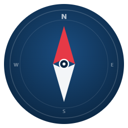

<p align="center">
  
</p>

<h1 align="center">Claim Compass</h1>


<p align="center">
  <b>An AI agent that reads your denied health insurance claim, finds the exact policy clause supporting an appeal, drafts the letter, and emails it.</b>
</p>

<p align="center">
  <a href="https://learn.microsoft.com/en-us/microsoft-copilot-studio/"></a>
  <a href="https://www.anthropic.com/claude"></a>
  <a href="https://microsoft.github.io/agent-academy/events/hackathon/"></a>
  
  
</p>

---

## The problem

KFF reports that US ACA marketplace insurers denied roughly **1 in 5 in-network claims in 2024**. Less than **1%** of those denials are ever appealed. Yet when people *do* appeal, about **44%** are overturned (closer to **80%** in Medicare Advantage).

The barrier isn't the policy. It is knowing what to say, how to write it, and where to send it. A patient-advocacy firm bills $150 to $200 per hour to read a plan, find the violated clause, draft the appeal, and send it.

Claim Compass collapses that workflow into one conversation.

**Sources:** [KFF, Claims Denials & Appeals in ACA Marketplace 2024](https://www.kff.org/patient-consumer-protections/claims-denials-and-appeals-in-aca-marketplace-plans-in-2024/) · [Axios, ACA insurers deny 20% of claims](https://www.axios.com/2025/01/30/aca-insurers-deny-claims-rate)

## Target users

- **Patients and plan members** with a denied claim who feel locked out by the appeal paperwork.
- **B2B**: patient-advocacy firms, hospital billing teams, and insurtechs that want to deploy a self-service tool. Claim Compass automates an entire salaried back-office role.

## Demo

▶ **[Watch the 5-minute demo on YouTube](https://www.youtube.com/watch?v=WyONSLqLGRI)**

The video walks through three real flows:
1. An appealable ER-ordered MRI denial, with a mid-conversation reasoning pivot when new facts come in.
2. A genuinely valid cosmetic-procedure denial that the agent honestly declines to appeal.
3. An out-of-scope question that the agent refuses politely, staying in its lane.

## How it works

```
1. User pastes a denial letter.
2. Agent grounds the denial against the plan policy PDF (RAG, citations).
3. Agent decides: APPEALABLE or LIKELY VALID, citing exact sections.
4. An Adaptive Card displays the verdict.
5. Agent drafts a formal appeal letter.
6. Agent asks for explicit user confirmation.
7. Agent emails the appeal via Outlook.
```

See [`architecture.md`](architecture.md) for the diagrams and full component breakdown.

## Agent Academy missions used

| Mission | How we use it |
|---|---|
| **M02** Copilot Studio fundamentals | Built on the four pillars: Knowledge, Tools, Topics, Instructions. |
| **M06** Custom agent with knowledge grounding | Plan policy PDF uploaded as the only knowledge source. Web Search is OFF so every answer is grounded with a citation. |
| **M07** Custom Topic with trigger and variables | `Show Verdict Card` topic with four input variables (`claimNumber`, `verdictLabel`, `citedSections`, `reasoning`), filled by the orchestrator from its own reasoning. |
| **M08** Adaptive Card with Power Fx | Verdict card uses Power Fx Formula mode to data-bind topic variables into a Microsoft Adaptive Card v1.5, embedded in a Send a Message node. |
| **M09** Connector tool as an agent action | Office 365 Outlook `Send an email (V2)` wired as a tool. `To`, `Subject`, and `Body` are AI-filled at runtime. |

## Safety and responsible AI

- **Grounding only.** Web Search is OFF. Answers come strictly from the uploaded policy doc.
- **Citations on every claim.** Every verdict and every paragraph of the appeal letter references a specific policy section.
- **Synthetic identity.** All demo conversations use a placeholder member, "Alex Morgan" / `CHP-DEMO-0001`. The agent's instructions tell it to ignore real PII the user may volunteer (SSN, full member IDs, etc.) and continue with placeholders.
- **Human in the loop.** The agent never sends an email without an explicit confirmation step that names the recipient, subject, and one-line summary.
- **Disclaimer on every appeal.** Every drafted letter is followed by a one-line disclaimer: *"Claim Compass provides policy-language interpretation only, not legal or medical advice."*
- **Out-of-scope guardrail.** The agent declines questions outside its scope (weather, programming, etc.) and redirects to its capabilities. See evaluation Test 7.

## Evaluation


We ran the included test set through the **Copilot Studio Evaluation tab** in Single-response mode. Eight scenarios cover appealable cases, honestly-valid denials (cosmetic, late filing, PT cap), procedurally defective denials, mixed in/out-of-network reasoning, out-of-scope refusal, and PII attempts.

> **Result: 88% (7 of 8) on automated evaluation. Effective accuracy on manual review: 8 of 8.**

The lone auto-fail is **Test 7, the out-of-scope refusal** ("what's the weather and write me a Python script?"). The agent's reply is the intended guardrail: a polite refusal that lists what it *can* help with. Copilot Studio's automated grader flagged it *"question not answered, relevance failed"* because the agent technically declined to answer. That refusal is the designed safety behavior, not a regression. Answering the off-topic question would itself be the bug. The test stays in the set because the pattern matters more than the score.

The human-readable test set is in [`evaluation-test-set.md`](evaluation-test-set.md). The CSV that powers the Copilot Studio evaluation is at [`claim-compass-evaluation.csv`](claim-compass-evaluation.csv).

## Setup for reviewers

<details>
<summary><b>Click to expand the import steps</b></summary>

> Reviewers need an active Copilot Studio environment to run Claim Compass. To reproduce:

1. **Prerequisites:** Microsoft 365 Business Basic (or higher), a Copilot Studio trial enabled on the same tenant, and a non-managed Power Apps Developer environment. The Office 365 Outlook connector must be available.
2. **Import the agent solution.** Download `claim-compass-solution.zip` from this repo. In Copilot Studio, open Solutions, click **Import**, select the zip, and wait for the import to finish.
3. **Upload the knowledge source.** Open the imported Claim Compass agent. Under Knowledge, add the file `Contoso-Health-Plan-Policy.pdf` from this repo. Wait for status to read *Ready*. Confirm Web Search is disabled.
4. **Verify the Outlook connector.** Under Tools, open Send an email (V2). Ensure the connection is signed in with your account (sign in if prompted).
5. **Test.** Open the Test pane and paste any input from `evaluation-test-set.md`.

</details>

## Repo contents

```
.
├── README.md                          this file
├── architecture.md                    diagrams and component breakdown
├── Contoso-Health-Plan-Policy.pdf     synthetic plan policy, knowledge source
├── Contoso-Health-Plan-Policy.html    source HTML for re-generating the PDF
├── verdict-card-powerfx.txt           Adaptive Card Power Fx formula
├── claim-compass-evaluation.csv       Copilot Studio evaluation CSV (8 cases)
├── evaluation-test-set.md             human-readable test set with expected outcomes
├── claim-compass-icon.html            icon source page (downloads PNG)
├── claim-compass-icon.png             exported agent icon
└── claim-compass-solution.zip         exported Copilot Studio solution
```

## Tech stack

- **Platform:** Microsoft Copilot Studio with Generative Orchestration enabled.
- **Reasoning model:** Claude Sonnet 4.6, selected from the built-in Copilot Studio model picker.
- **Knowledge grounding:** Dataverse-backed file upload with retrieval-augmented generation.
- **UI:** Adaptive Card v1.5 with Power Fx data binding.
- **Connector:** Office 365 Outlook, `Send an email (V2)`.

## Limitations and honest caveats


- The Contoso plan policy is **synthetic** for demo safety. A production deployment would ground against an actual insurer plan document.
- The Copilot Studio trial license **blocks publishing** to Teams or M365 Copilot. The demo runs in the Test pane, which is functionally complete and shows the full activity map.
- The Adaptive Card's action buttons are **visual only**. Clicking them does not fire. The agent advances via natural conversation. This was an intentional trade-off to avoid the schema-binding complexity of the interactive "Ask with Adaptive Card" node, in favor of the simpler display-only "Send a message + Adaptive Card" pattern documented by Microsoft.

## Submission

Built for the **Microsoft Agent Academy Hackathon 2026** in the **Recruit** track by **Gagan Singh**.

## License

MIT (see `LICENSE`). The synthetic policy document is for demonstration only.
