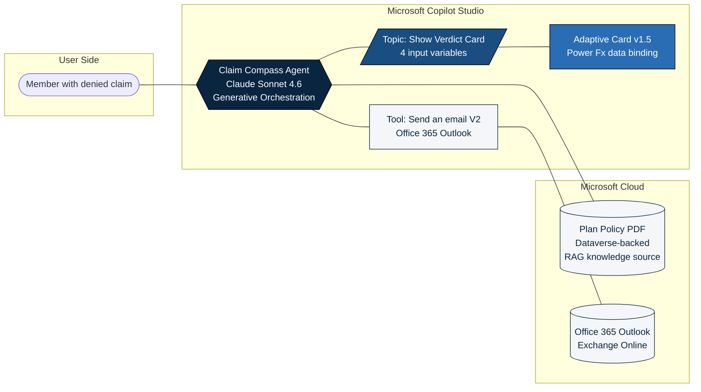
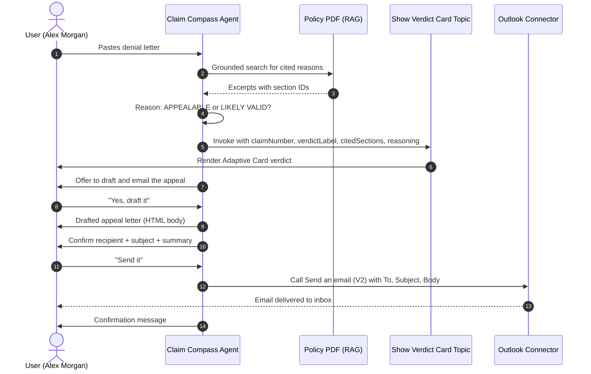

# Architecture

This document describes the Claim Compass agent's components, data flow, and integration points.

## Component diagram

## Sequence (one full appeal flow)

## Component breakdown

| Component | Microsoft technology | Role in the flow |
|---|---|---|
| **Agent brain** | Copilot Studio agent. Model: Claude Sonnet 4.6. Generative Orchestration ON. | Parses the denial, reasons over the policy, plans which tool or topic to invoke. |
| **Knowledge** | File upload stored in Dataverse. Web Search **disabled**. | Retrieval-augmented grounding. Every answer must come from the policy PDF, with a clickable citation. |
| **Topic** | Custom topic `Show Verdict Card` with four input variables (`claimNumber`, `verdictLabel`, `citedSections`, `reasoning`). | The orchestrator fills the inputs from its own analysis, then the topic renders the visual verdict. |
| **Adaptive Card** | Power Fx Formula card embedded in a *Send a message* node (per Microsoft's documented pattern for display-only cards). | Product-grade verdict UI that data-binds to the topic variables. |
| **Tool** | Office 365 Outlook connector, `Send an email (V2)`. To, Subject, and Body are AI-filled at runtime. | Sends the drafted appeal letter once the user confirms. |
| **Safety layer** | Agent instructions: synthetic identity, disclaimer footer, human-in-the-loop email confirmation, no PII handling. | Enforces the Reliability and Safety rubric pillar. |

## Agent Academy missions touched

- **M02** Copilot Studio fundamentals (Knowledge, Tools, Topics, Instructions).
- **M06** Custom agent grounded in uploaded knowledge with citations.
- **M07** Custom Topic with trigger description, input variables, and Power Fx.
- **M08** Adaptive Card with Power Fx data binding inside a *Send a message* node.
- **M09** Connector tool wired as an agent action (Office 365 Outlook).

## Why the design holds up

- **Grounded.** Web Search is off and Web grounding is unused. The only source of truth is the policy PDF. The agent cannot invent a coverage rule because it has no access to one.
- **Cited.** Every paragraph the agent writes traces back to a section number (1.1, 1.4, 6.5, etc.). A reviewer can verify each claim in seconds.
- **Confirmed.** No email leaves the agent without an explicit human acknowledgment that names the recipient, subject, and one-line summary. The audit trail is clean.
- **Honest.** Tested against denials that *should* succeed (Test 2 cosmetic, Test 5 PT cap) and the agent declines to draft an appeal. It does not optimize for "always appeal", it optimizes for "appeal when the policy supports it".
